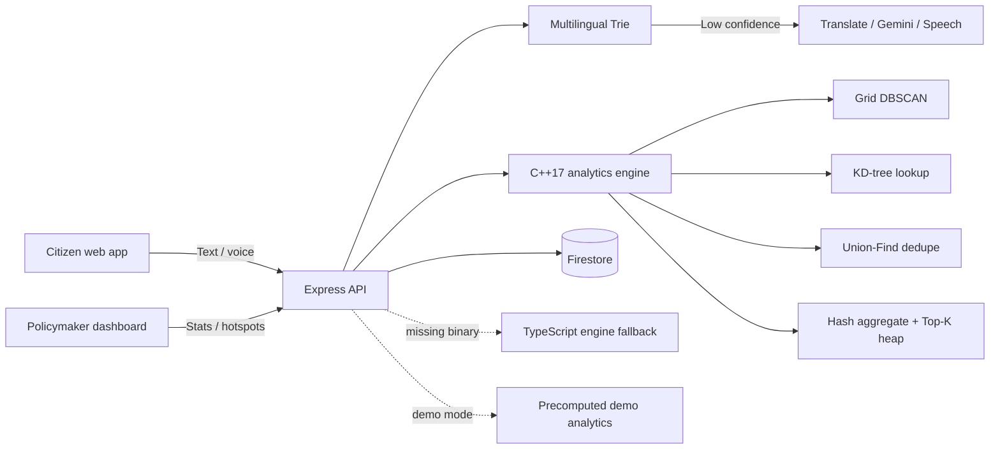

# CivicPulse

CivicPulse is a multilingual Digital Public Good that turns citizen feedback into actionable infrastructure priorities.
Built to scale across BRICS communities, it supports local voices in English, Hindi, Portuguese, Russian, and Chinese.

## Setup

Requires Node.js 20+ and npm. From the repository root:

```sh
npm install
Copy-Item .env.example .env
npm run dev
```

The app runs at `http://localhost:5173`; the API runs at `http://localhost:3001`. Vite proxies `/api` to the backend.
Demo mode is enabled by default and serves stable precomputed analytics when Google or Gemini credentials are absent.
To use Firebase and live Google/Gemini integrations, set `FIREBASE_PROJECT_ID`, `FIREBASE_CLIENT_EMAIL`,
`FIREBASE_PRIVATE_KEY`, `GOOGLE_CLOUD_KEY`, and `GEMINI_API_KEY` in `.env`.

Validate with `npm run build`, `npm run lint`, and `npm run format:check`.
Seed Firestore with `npm run seed --workspace backend`; validate local fixtures with `npm run seed:validate --workspace backend`.
Build and test the C++17 engine with `mingw32-make -C engine clean all test` on MinGW or `make -C engine clean all test` on Unix.

## Architecture



## Algorithms

| Operation                     | Approach                                      | Time complexity                                                   |
| ----------------------------- | --------------------------------------------- | ----------------------------------------------------------------- |
| Keyword classification        | Multilingual Trie scan                        | O(L) for bounded vocabulary                                       |
| District lookup               | Balanced 3D KD-tree, haversine final distance | O(log d) average; O(d) worst case                                 |
| Complaint clustering          | Uniform 3D grid-indexed DBSCAN                | Expected near O(n + candidate pairs); O(n²) dense worst case      |
| Duplicate merging             | Spatial grid + Union-Find                     | Expected O(n + candidate pairs) with amortized O(alpha(n)) unions |
| District/category aggregation | Hash maps                                     | O(n) expected                                                     |
| Priority Top-K                | Bounded min-heap                              | O(d log K)                                                        |
| Dashboard stats               | Single-pass counters and sets                 | O(n)                                                              |

## Workspaces

- `frontend`: React 18, Vite, TypeScript, Tailwind CSS, Framer Motion, Leaflet, and Recharts.
- `backend`: Node.js, Express, TypeScript, Firebase Admin, and bounded Google/Gemini integrations.
- `engine`: C++17 JSON command-line analytics engine using the vendored nlohmann single header.
- `shared`: canonical TypeScript API and domain types.

Build the C++ engine with CMake:

```sh
cmake -S engine -B engine/build
cmake --build engine/build
```
